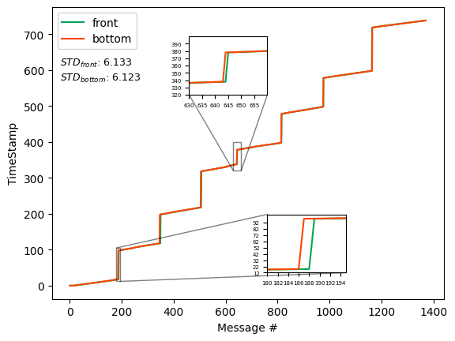
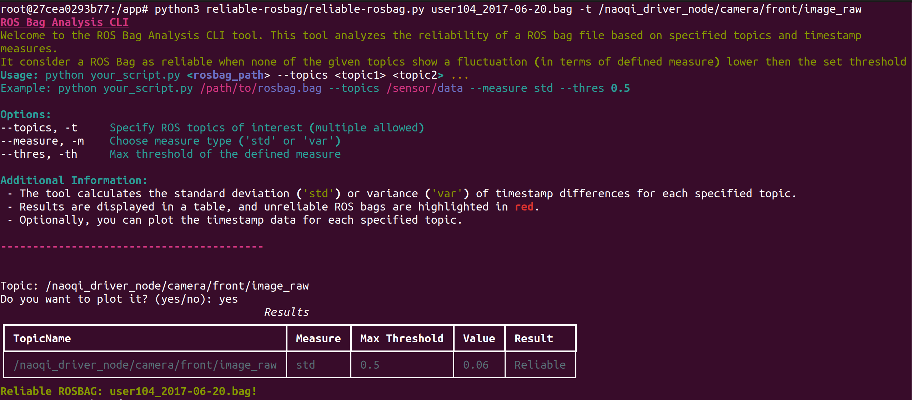
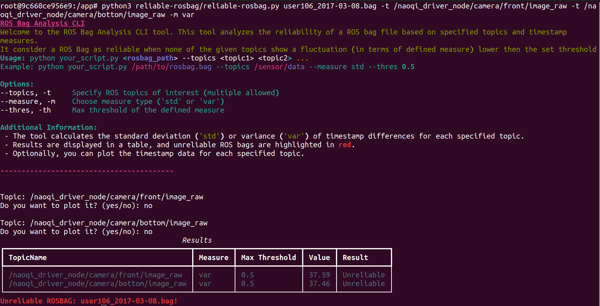

<p align="center">
  <a href="https://github.com/Prisca-Lab/reliable-rosbag">
  
  </a>
  <h1 align="center">reliable-dataset</h1>
</p>

This is a python script that can be used to check the reliability of a rosbag file. 
Here you can find the implementation described in the paper "A Rosbag Tool to Improve Dataset Reliability" by F. Vigni, A. Andriella, S. Rossi.

File named "user106_2017-03-08.bag" of UE-HRI Dataset: 




## Usage
You can either directly run the script or use the docker image as described below.


Build the docker image with the following command:
```
docker build -t reliable-rosbag .
```

Run the built docker container with the following command:

```
docker run -it -v ${PWD}:/app/ reliable-rosbag 
```

Locate the rosbag file you want to check in the root folder of this repository or pass the full path to the script.
Now you can run the reliable-rosbag.py script from the docker container with the following command:

```
python3 reliable-rosbag.py <bag-name> -t <topic1> -t <topic2> ...
```

## Example

Given the following rosbag file:
- user106_2017-03-08.bag

and the following topics:
- /naoqi_driver_node/camera/front/image_raw
- /naoqi_driver_node/camera/bottom/image_raw

The complete command to run the script is the following:

```
python3 reliable-rosbag.py user106_2017-03-08.bag -t /naoqi_driver_node/camera/front/image_raw -t /naoqi_driver_node/camera/bottom/image_raw
```


## Screenshots

Output in case of reliable rosbag file:




Output in case of unreliable rosbag file:


