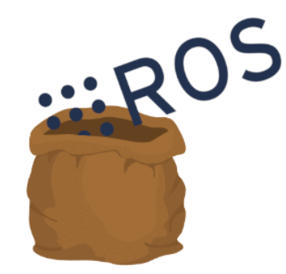
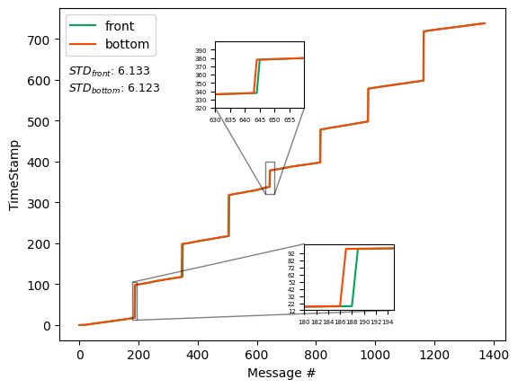
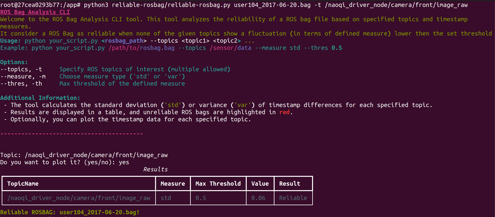
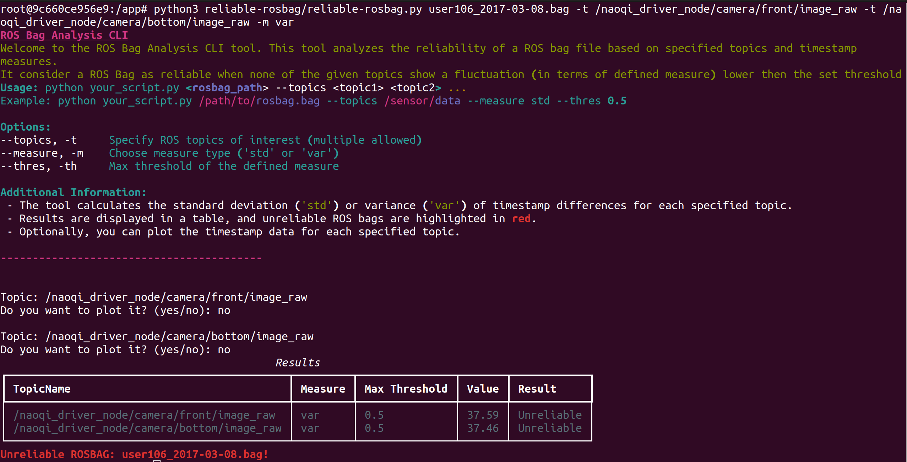

<p align="center">
  <a href="https://github.com/Prisca-Lab/reliable-dataset">
  
  </a>
  <h1 align="center">reliable-dataset</h1>
</p>

<p align="center">
  <a href="https://doi.org/10.1145/3610978.3640556"></a>
  <a href="LICENSE"></a>
  <!-- After the first Zenodo release, paste the Zenodo "concept DOI" badge here. -->
</p>

This is a python script that can be used to check the reliability of a rosbag file. 
Here you can find the implementation described in the paper "A Rosbag Tool to Improve Dataset Reliability" by F. Vigni, A. Andriella, S. Rossi.

> **Paper:** F. Vigni, A. Andriella, and S. Rossi. *A Rosbag Tool to Improve Dataset Reliability.*
> In Companion of the 2024 ACM/IEEE International Conference on Human-Robot Interaction
> (HRI '24 Companion), Boulder, CO, USA, pp. 1085–1089. ACM, 2024.
> [doi:10.1145/3610978.3640556](https://doi.org/10.1145/3610978.3640556)

This repository is the source code for reproducing the results reported in that paper. See
[Reproducing the paper](#reproducing-the-paper) below.

File named "user106_2017-03-08.bag" of UE-HRI Dataset: 




## Usage
You can either directly run the script or use the docker image as described below.


Build the docker image with the following command:
```
docker build -t reliable-rosbag .
```

Run the built docker container with the following command:

```
docker run -it -v ${PWD}:/app/ reliable-rosbag 
```

Locate the rosbag file you want to check in the root folder of this repository or pass the full path to the script.
Now you can run the reliable-rosbag.py script from the docker container with the following command:

```
python3 reliable-rosbag.py <bag-name> -t <topic1> -t <topic2> ...
```

## Example

Given the following rosbag file:
- user106_2017-03-08.bag

and the following topics:
- /naoqi_driver_node/camera/front/image_raw
- /naoqi_driver_node/camera/bottom/image_raw

The complete command to run the script is the following:

```
python3 reliable-rosbag.py user106_2017-03-08.bag -t /naoqi_driver_node/camera/front/image_raw -t /naoqi_driver_node/camera/bottom/image_raw
```


## Screenshots

Output in case of reliable rosbag file:




Output in case of unreliable rosbag file:




## Reproducing the paper

The evaluation in the paper (Section 5) was run on the [UE-HRI dataset](https://www.di.ens.fr/willow/research/uehri/)
(Ben-Youssef et al., 2017), which contains 54 rosbags recorded with the Pepper robot.

Settings used in the paper:

| Setting | Value |
| --- | --- |
| Measure | `std` (standard deviation of the time differences between consecutive messages) |
| Threshold | `0.5` |
| Topics | `/naoqi_driver_node/camera/front/image_raw` and `/naoqi_driver_node/camera/bottom/image_raw` |

A rosbag is marked unreliable when *either* camera stream exceeds the threshold (safety-first policy).
Running the tool over all 54 rosbags with these settings reproduces the reported result:
**17 of 54 rosbags (31.48%) are unreliable.**

For a single rosbag, e.g. `user106_2017-03-08.bag` (Figure 3b in the paper, an unreliable one):

```
python3 reliable-rosbag.py user106_2017-03-08.bag \
  -t /naoqi_driver_node/camera/front/image_raw \
  -t /naoqi_driver_node/camera/bottom/image_raw \
  -m std -th 0.5
```

`user104_2017-06-20.bag` (Figure 3a) is an example of a reliable one.


## Citation

If you use this tool, please cite the paper:

```bibtex
@inproceedings{vigni2024rosbag,
  author    = {Vigni, Francesco and Andriella, Antonio and Rossi, Silvia},
  title     = {A Rosbag Tool to Improve Dataset Reliability},
  booktitle = {Companion of the 2024 ACM/IEEE International Conference on Human-Robot Interaction (HRI '24 Companion)},
  year      = {2024},
  pages     = {1085--1089},
  publisher = {Association for Computing Machinery},
  address   = {New York, NY, USA},
  isbn      = {979-8-4007-0323-2},
  doi       = {10.1145/3610978.3640556},
  location  = {Boulder, CO, USA}
}
```

Machine-readable citation metadata is in [`CITATION.cff`](CITATION.cff).


## License

Distributed under the GNU GPLv3 license. See [`LICENSE`](LICENSE).
